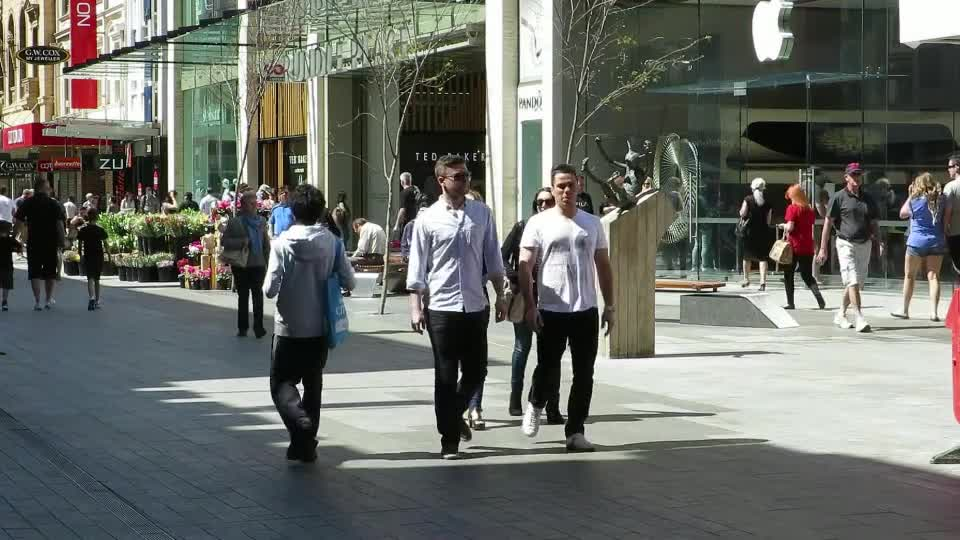
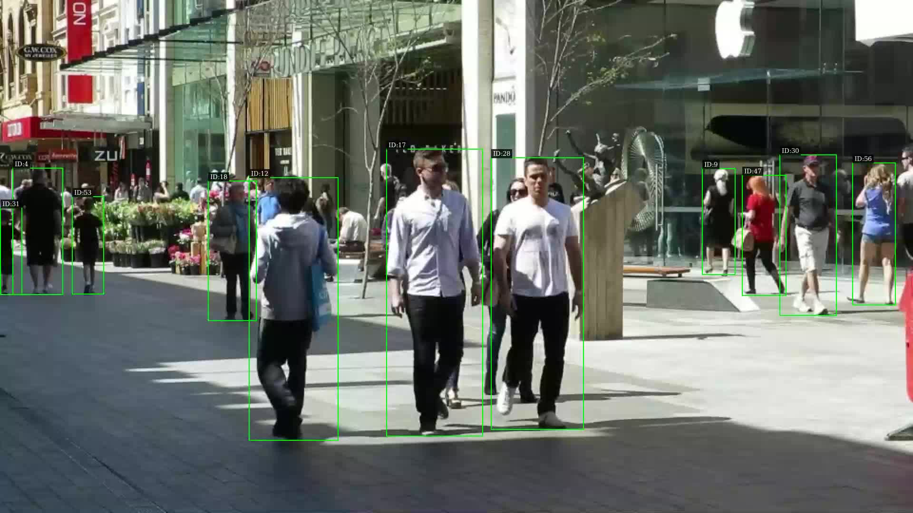

# Person Tracking Pipeline

Multi-person detection and tracking on NVIDIA Jetson using DeepStream 7.1.

## Demo

| Input | Output |
|:--:|:--:|
|  |  |

[Download input video (MOT16-08)](demo/input_MOT16-08.mp4) | [Download output video](demo/output_tracked.mp4)

## Pipeline

```
filesrc → qtdemux → h264parse → nvv4l2decoder (NVDEC)
→ nvstreammux → nvinfer (PeopleNet) → nvtracker (NvDeepSORT)
→ nvdsosd → nvvideoconvert → nvv4l2h264enc (NVENC) → mp4mux → filesink
```

- **PeopleNet v2.3.4**: ResNet-34 detector, INT8 quantized, 960×544 input, 3 classes (person/bag/face)
- **NvDeepSORT + OSNet**: 512-dim re-ID features (MSMT17-trained), occlusion recovery up to ~2s
- Full GPU pipeline: NVDEC → TensorRT → NVENC, no CPU-GPU copies

## Quick Start

```bash
docker build -t person-tracker .

mkdir -p output
docker run --runtime=nvidia \
  -v /path/to/your/videos:/data \
  -v $(pwd)/output:/app/output \
  person-tracker \
  --input /data/video.mp4 \
  --output /app/output/tracked.mp4
```

First run compiles TensorRT engines (~9 min). Subsequent runs start instantly.

## Requirements

- NVIDIA Jetson (JetPack 6.x / L4T R36.x)
- Docker with `--runtime=nvidia`
- H.264 MP4 input video

## Performance

| Metric | Value |
|--------|-------|
| FPS | ~15 (with re-ID) |
| Input | 1920×1080 @ 30fps |
| Detection | INT8 |
| Re-ID | FP16 |
